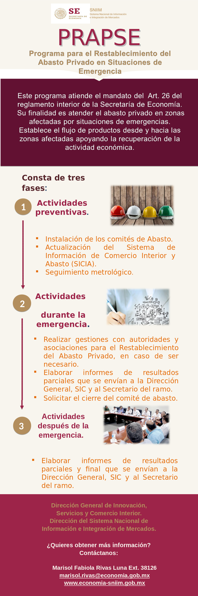

# Programa para el Restablecimiento del Abasto Privado en Situaciones de Emergencia 

_Dentro de la Secretairía de Economía se encunetra el SNIIM,el cual tiene a su cargo el PRAPSE, es un programa que como su nombre lo dice se implementa en situaciones de emergencia_

La infografai mostrada en la parte de abajo es el objetivo de dicho programa.

## Construido con 🛠️

__

* [Bootstrap](https://getbootstrap.com/) - El framework web usado
* [Atom](https://atom.io/) - El editor de texto utilizado
* [Arcgis](https://developers.arcgis.com/javascript/) - Usamos el API de JavaScript de ArcGIS para las capas del mapa 
* [JavaScript](https://www.w3schools.com/js/) - Usamos el API de JavaScript de ArcGIS para las capas del mapa 

El resto del software utilizado es el normal para HTML5, PHP, CSS3 , entre algunos metodos de consulta como AJAX, JS, etc. 

## Contribuyendo 🖇️

## Wiki 📖

Puedes encontrar la version final implementada aqui [Wiki](http://www.atlasnacionalderiesgos.gob.mx/SE-CENAPRED/)

## Autores ✒️

* **Ramos Rojas Jose Alberto** - [JAlberto](https://github.com/JAlberto9)
* **** - *Documentación* 

